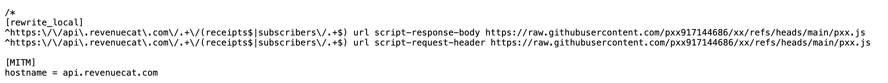
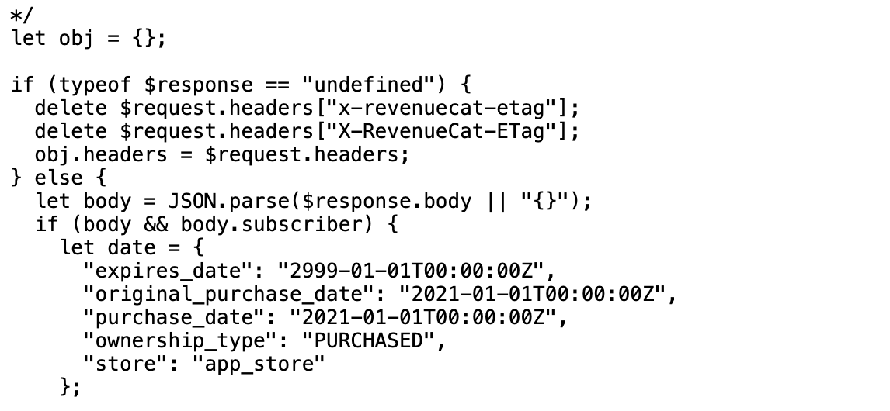

<table border="1" cellpadding="10" cellspacing="0" style="border-collapse: collapse; width: 100%; text-align: left;">
  <thead>
    <tr>
      <th>链接</th>
      <td rowspan="3"><strong>https://raw.githubusercontent.com/pxx917144686/xx/refs/heads/main/pxx.js</strong></td>
    </tr>
  </thead>
    <tr>
      <td>001</td>
      <td><a href="https://apps.apple.com/app/id6450694828" target="_blank">Ereasy</a></td>
    </tr>
    <tr>
      <td>002</td>
      <td><a href="https://apps.apple.com/app/id1365531024" target="_blank">1Blocker</a></td>
    </tr>
     <tr>
      <td>003</td>
      <td><a href="https://apps.apple.com/app/id1387167765" target="_blank">Diarly</a></td>
    </tr>
  </tbody>
</table>

👇

[rewrite_local] ——> //这是一个重写功能;

api.revenuecat.com ——> //当这样的请求出现时，会拦截该请求;

url script-response-body ——> //在拦截到响应后，使用一个脚本修改响应的内容;

raw.githubusercontent.com/pxx917144686/xx/refs/heads/main/pxx.js ——> //这个链接是脚本的来源地址;

👇

[MITM]
hostname = api.revenuecat.com

——> //这是中间人攻击（MITM功能）

——> //要拦截的主机名api.revenuecat.com

👇

